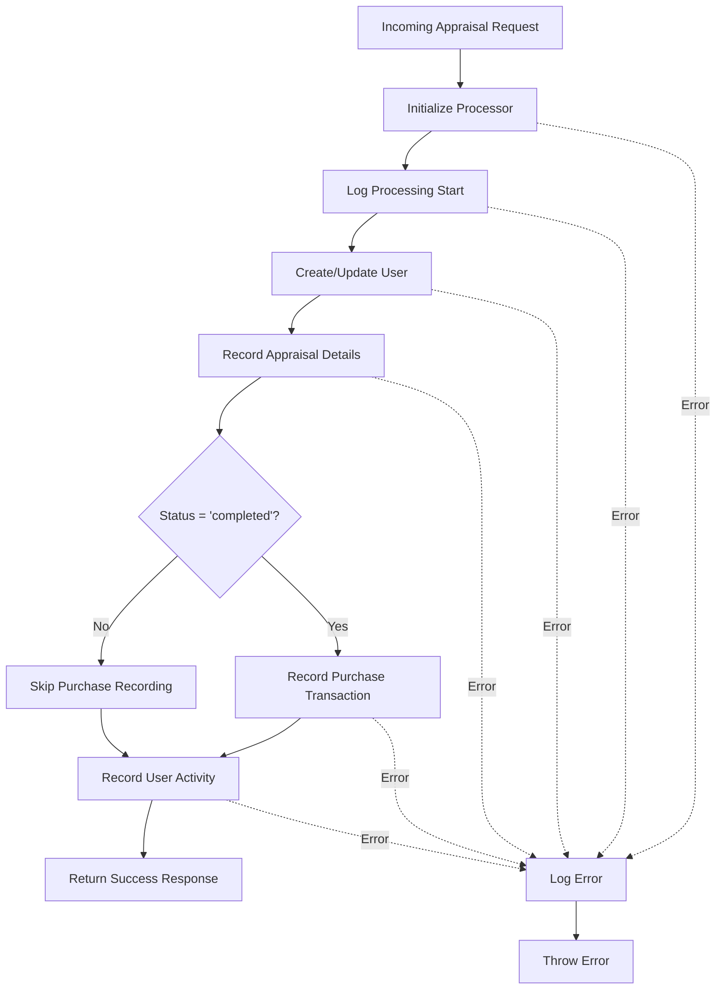
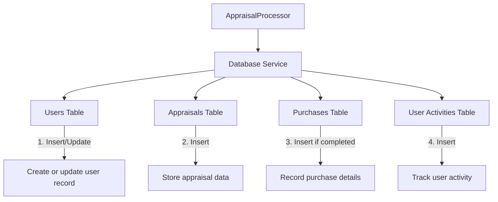
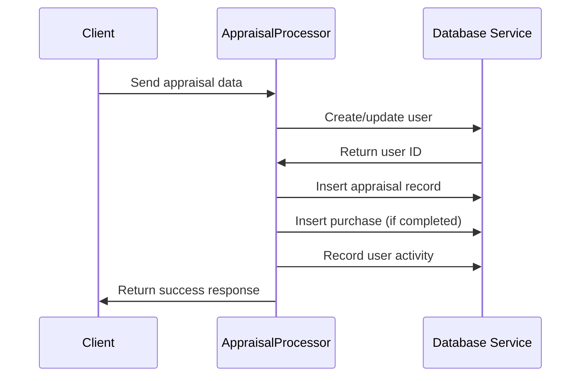

# Appraisal Processing Flow

```mermaid
graph TD
    A[Incoming Appraisal Request] --> B[Initialize Processor]
    B --> C[Log Processing Start]
    C --> D[Create/Update User]
    D --> E[Record Appraisal Details]
    E --> F{Status = 'completed'?}
    F -->|Yes| G[Record Purchase Transaction]
    F -->|No| H[Skip Purchase Recording]
    G --> I[Record User Activity]
    H --> I
    I --> J[Return Success Response]
    
    %% Error handling
    B -.->|Error| K[Log Error]
    C -.->|Error| K
    D -.->|Error| K
    E -.->|Error| K
    G -.->|Error| K
    I -.->|Error| K
    K --> L[Throw Error]
```

## Database Interactions

```mermaid
graph TD
    A[AppraisalProcessor] --> B[Database Service]
    B --> C[Users Table]
    B --> D[Appraisals Table]
    B --> E[Purchases Table]
    B --> F[User Activities Table]
    
    C -->|1. Insert/Update| G[Create or update user record]
    D -->|2. Insert| H[Store appraisal data]
    E -->|3. Insert if completed| I[Record purchase details]
    F -->|4. Insert| J[Track user activity]
```

## Data Flow

```mermaid
sequenceDiagram
    participant Client
    participant Processor as AppraisalProcessor
    participant DB as Database Service
    
    Client->>Processor: Send appraisal data
    Processor->>DB: Create/update user
    DB->>Processor: Return user ID
    Processor->>DB: Insert appraisal record
    Processor->>DB: Insert purchase (if completed)
    Processor->>DB: Record user activity
    Processor->>Client: Return success response
``` 