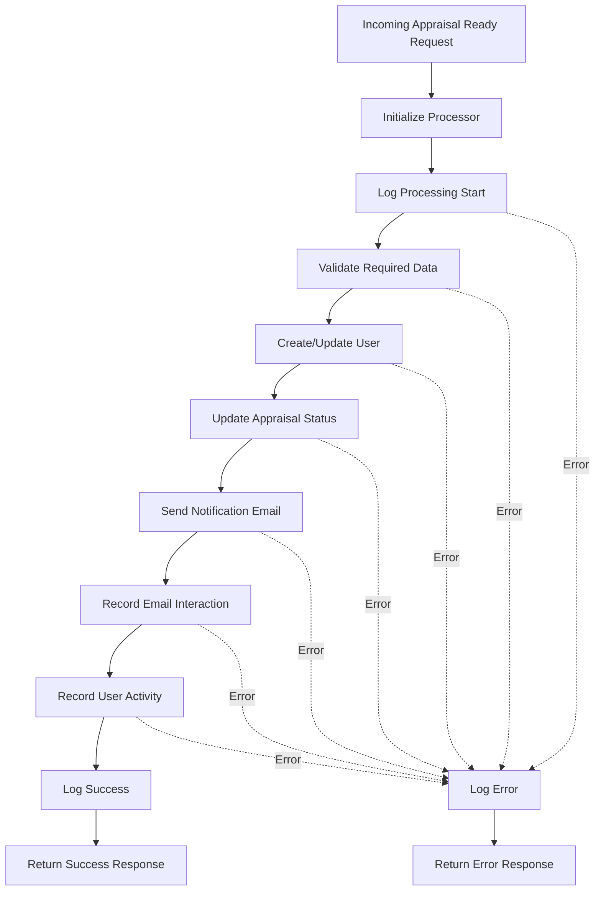
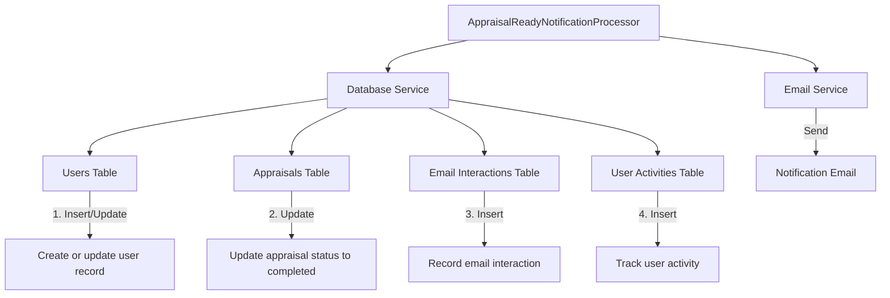
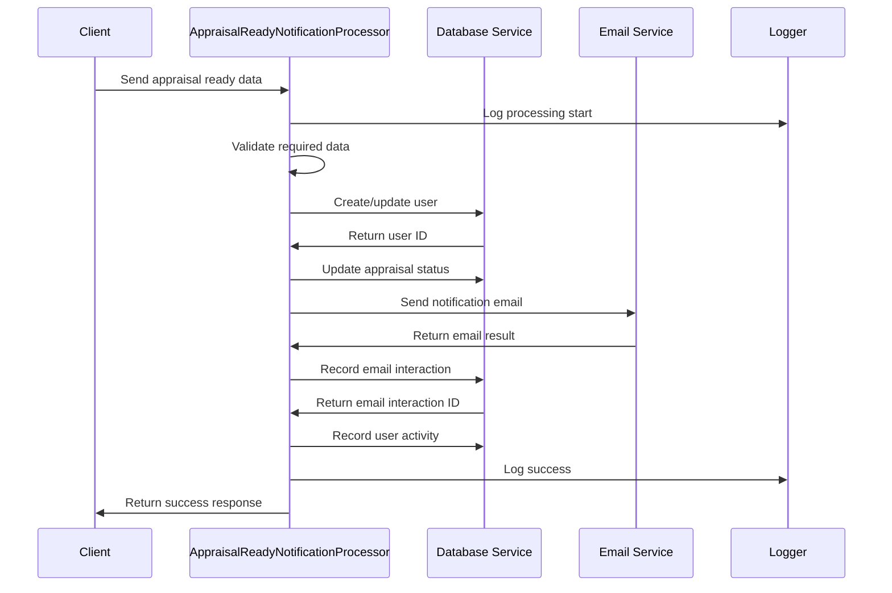
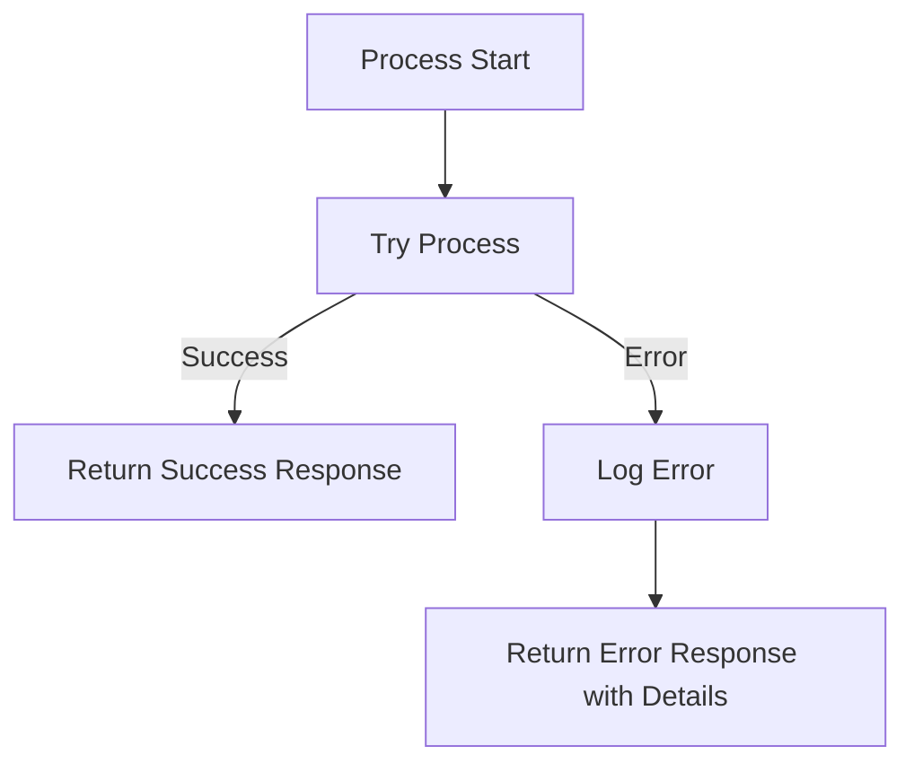

# Appraisal Ready Notification Processing Flow



## Database Interactions



## Data Flow



## Error Handling



## Expected Input Format

```json
{
  "customer": {
    "email": "customer@example.com",
    "firstName": "John",
    "lastName": "Doe"
  },
  "appraisal": {
    "id": "apr_12345",
    "sessionId": "sess_67890",
    "reportUrl": "https://dashboard.example.com/appraisals/apr_12345/report",
    "type": "standard",
    "itemDescription": "Vintage Watch",
    "estimatedValue": "$1,500",
    "completedDate": "2023-06-15T14:30:00.000Z",
    "imageUrl": "https://storage.example.com/appraisal-images/item123.jpg"
  },
  "metadata": {
    "origin": "web",
    "environment": "production",
    "timestamp": "2023-06-15T14:35:00.000Z"
  }
}
```

This diagram illustrates the appraisal ready notification process flow, which updates the appraisal status in the database, sends a notification email to the customer, and records all relevant interactions. 