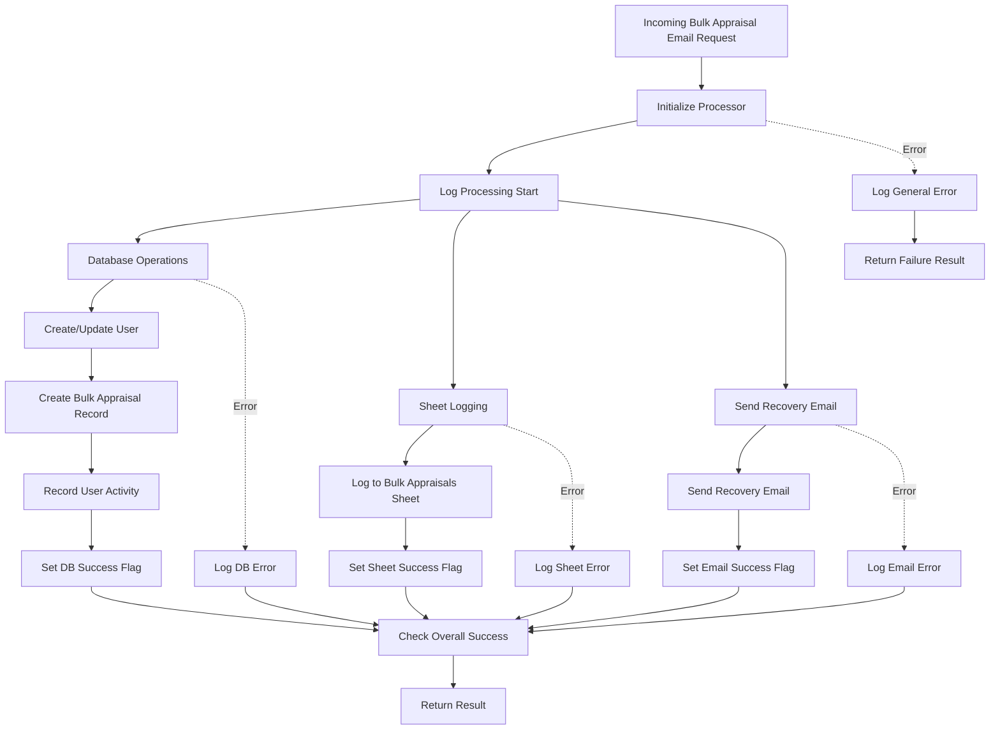
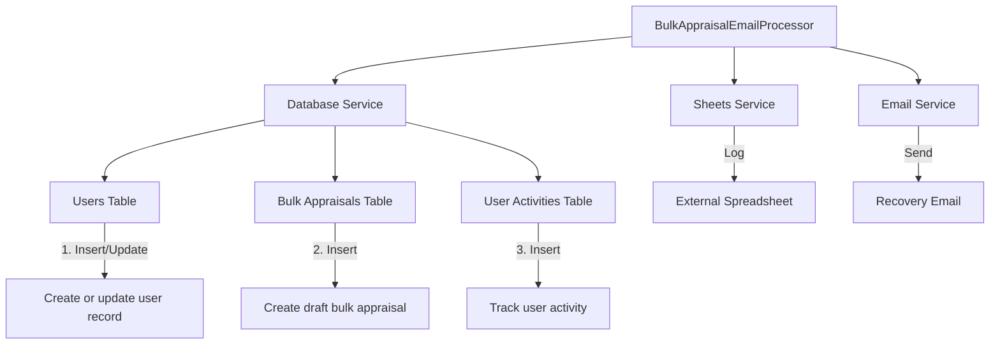
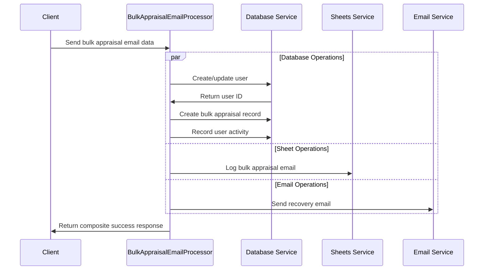
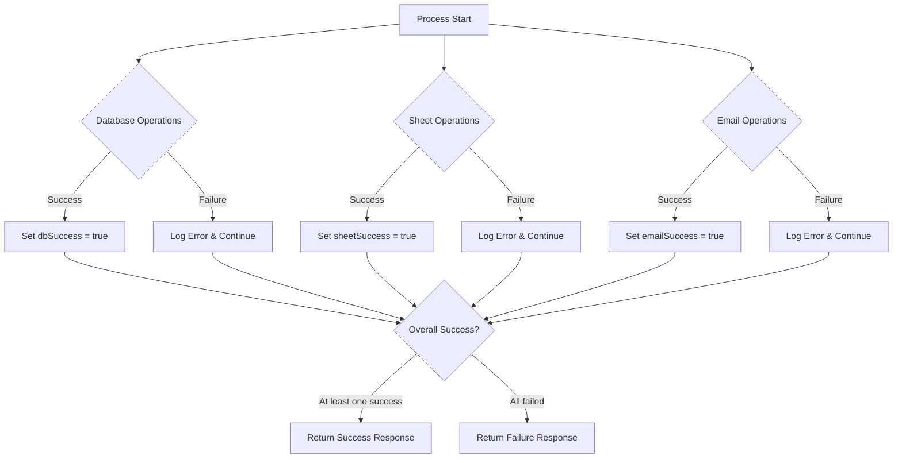

# Bulk Appraisal Email Processing Flow

```mermaid
graph TD
    A[Incoming Bulk Appraisal Email Request] --> B[Initialize Processor]
    B --> C[Log Processing Start]
    
    %% Three parallel operations
    C --> D[Database Operations]
    C --> E[Sheet Logging]
    C --> F[Send Recovery Email]
    
    %% Database operations
    D --> D1[Create/Update User]
    D1 --> D2[Create Bulk Appraisal Record]
    D2 --> D3[Record User Activity]
    D3 --> D4[Set DB Success Flag]
    
    %% Sheet operations
    E --> E1[Log to Bulk Appraisals Sheet]
    E1 --> E2[Set Sheet Success Flag]
    
    %% Email operations
    F --> F1[Send Recovery Email]
    F1 --> F2[Set Email Success Flag]
    
    %% Result determination
    D4 --> G[Check Overall Success]
    E2 --> G
    F2 --> G
    G --> H[Return Result]
    
    %% Error handling
    D -.->|Error| D5[Log DB Error]
    D5 --> G
    E -.->|Error| E3[Log Sheet Error]
    E3 --> G
    F -.->|Error| F3[Log Email Error]
    F3 --> G
    B -.->|Error| I[Log General Error]
    I --> J[Return Failure Result]
```

## Database Interactions

```mermaid
graph TD
    A[BulkAppraisalEmailProcessor] --> B[Database Service]
    A --> C[Sheets Service]
    A --> D[Email Service]
    
    B --> E[Users Table]
    B --> F[Bulk Appraisals Table]
    B --> G[User Activities Table]
    
    E -->|1. Insert/Update| H[Create or update user record]
    F -->|2. Insert| I[Create draft bulk appraisal]
    G -->|3. Insert| J[Track user activity]
    
    C -->|Log| K[External Spreadsheet]
    D -->|Send| L[Recovery Email]
```

## Data Flow

```mermaid
sequenceDiagram
    participant Client
    participant Processor as BulkAppraisalEmailProcessor
    participant DB as Database Service
    participant Sheets as Sheets Service
    participant Email as Email Service
    
    Client->>Processor: Send bulk appraisal email data
    
    par Database Operations
        Processor->>DB: Create/update user
        DB->>Processor: Return user ID
        Processor->>DB: Create bulk appraisal record
        Processor->>DB: Record user activity
    and Sheet Operations
        Processor->>Sheets: Log bulk appraisal email
    and Email Operations
        Processor->>Email: Send recovery email
    end
    
    Processor->>Client: Return composite success response
```

## Error Handling and Recovery

```mermaid
flowchart TD
    A[Process Start] --> B{Database Operations}
    B -->|Success| C[Set dbSuccess = true]
    B -->|Failure| D[Log Error & Continue]
    
    A --> E{Sheet Operations}
    E -->|Success| F[Set sheetSuccess = true]
    E -->|Failure| G[Log Error & Continue]
    
    A --> H{Email Operations}
    H -->|Success| I[Set emailSuccess = true]
    H -->|Failure| J[Log Error & Continue]
    
    C --> K{Overall Success?}
    D --> K
    F --> K
    G --> K
    I --> K
    J --> K
    
    K -->|At least one success| L[Return Success Response]
    K -->|All failed| M[Return Failure Response]
``` 