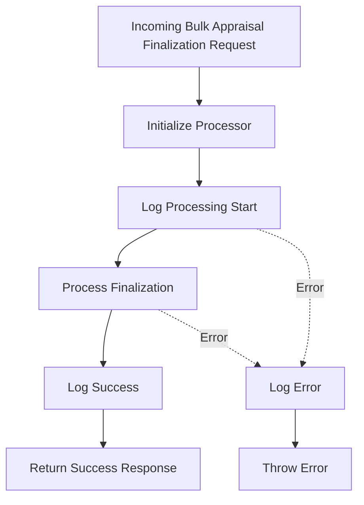
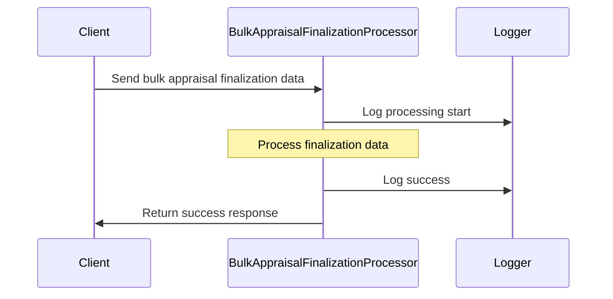
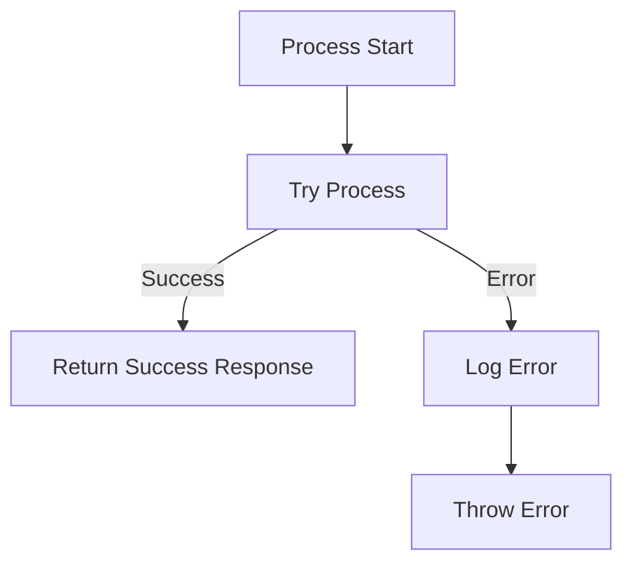
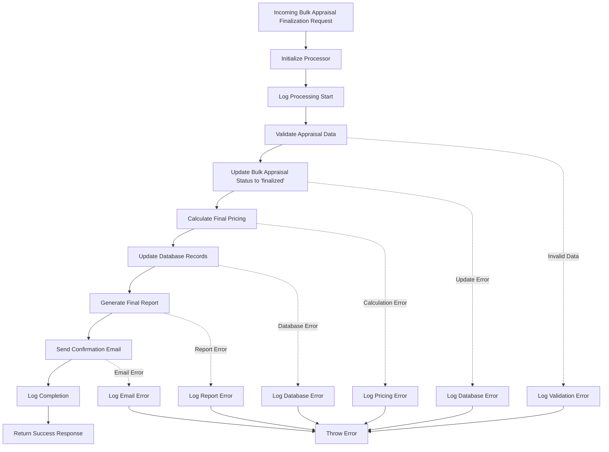

# Bulk Appraisal Finalization Processing Flow

## Data Flow

## Error Handling

## Future Implementation

This diagram represents the current implementation which simply acknowledges the finalization request. The "Future Implementation" section outlines a more comprehensive process that could be implemented to fully handle the finalization workflow. 