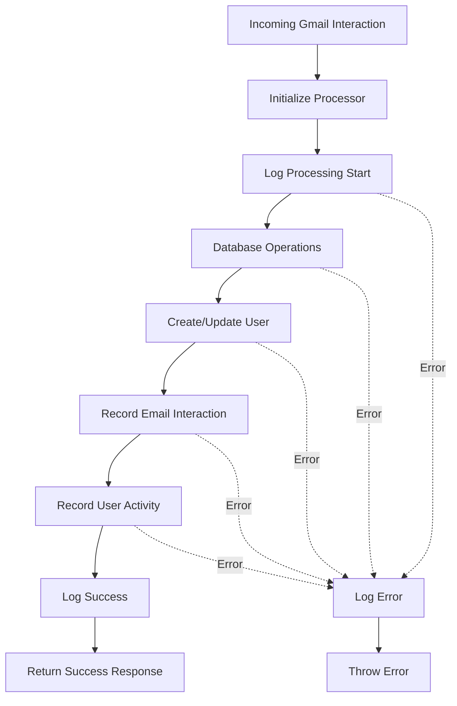
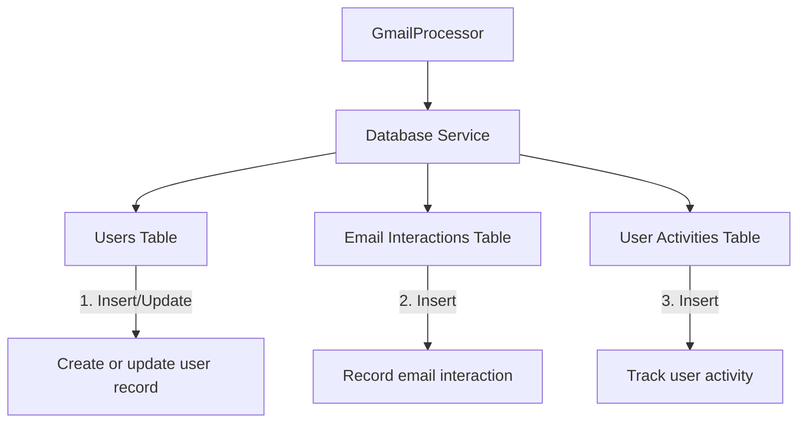
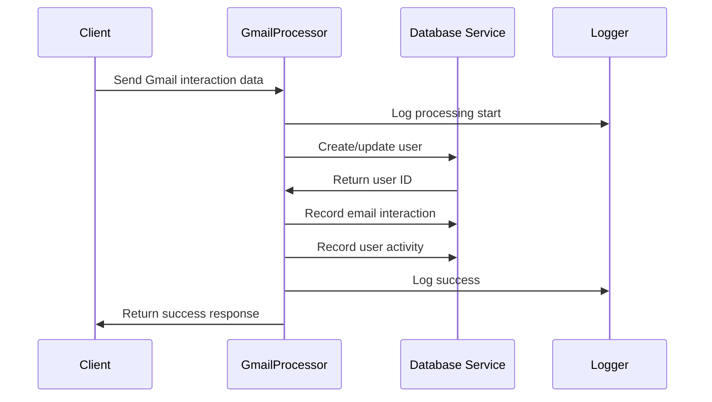
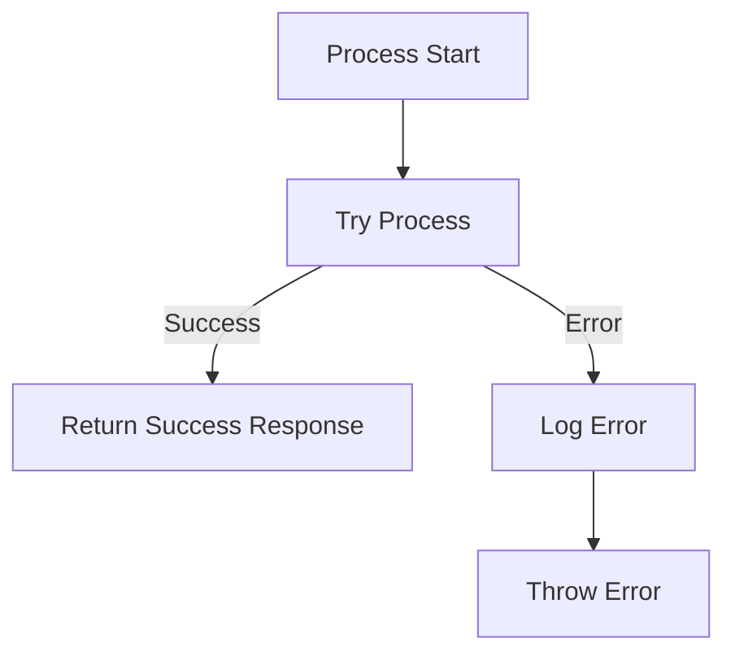

# Gmail Processing Flow

## Database Interactions

## Data Flow

## Error Handling

This diagram illustrates the Gmail processing flow, which handles incoming Gmail interactions by storing user data, email interactions, and activity records in the database. 