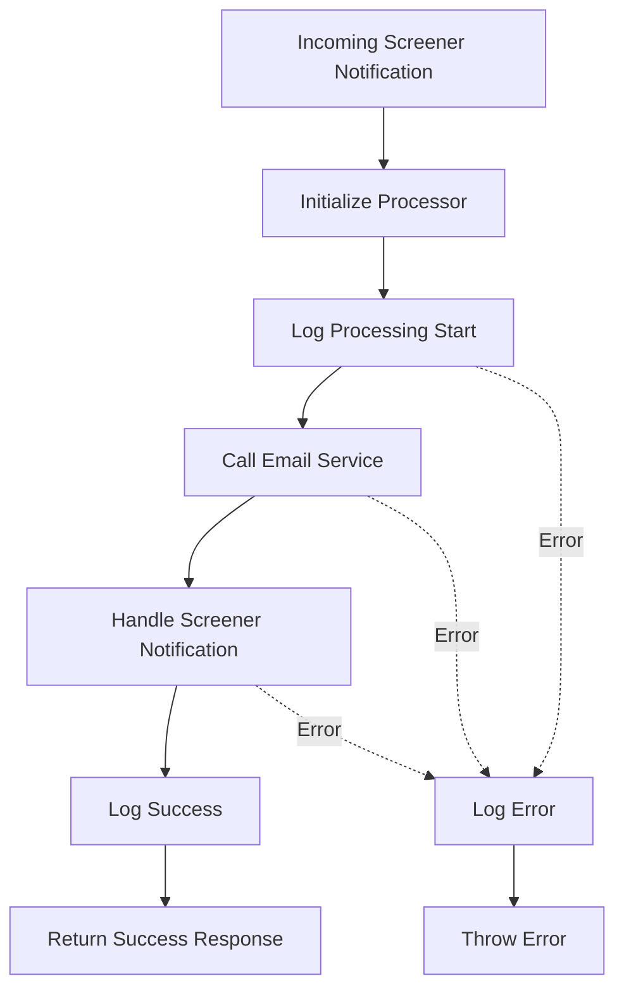
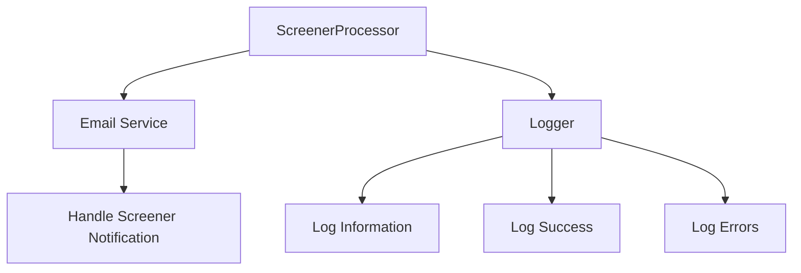
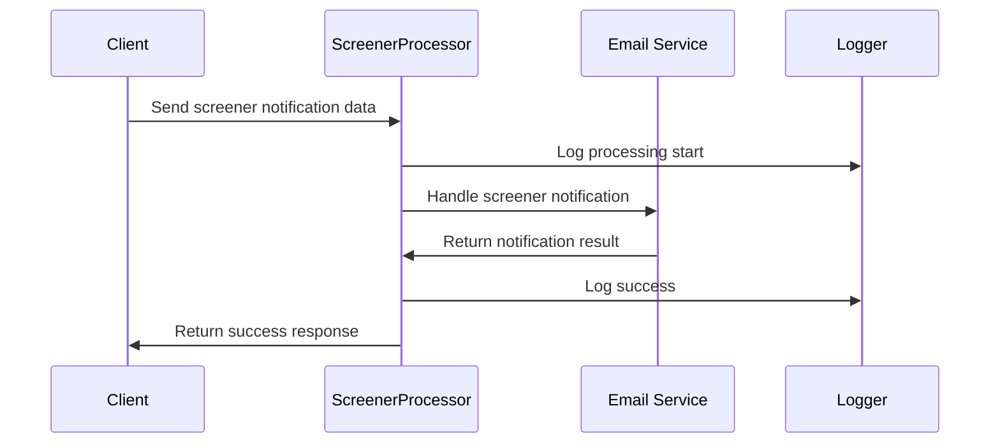
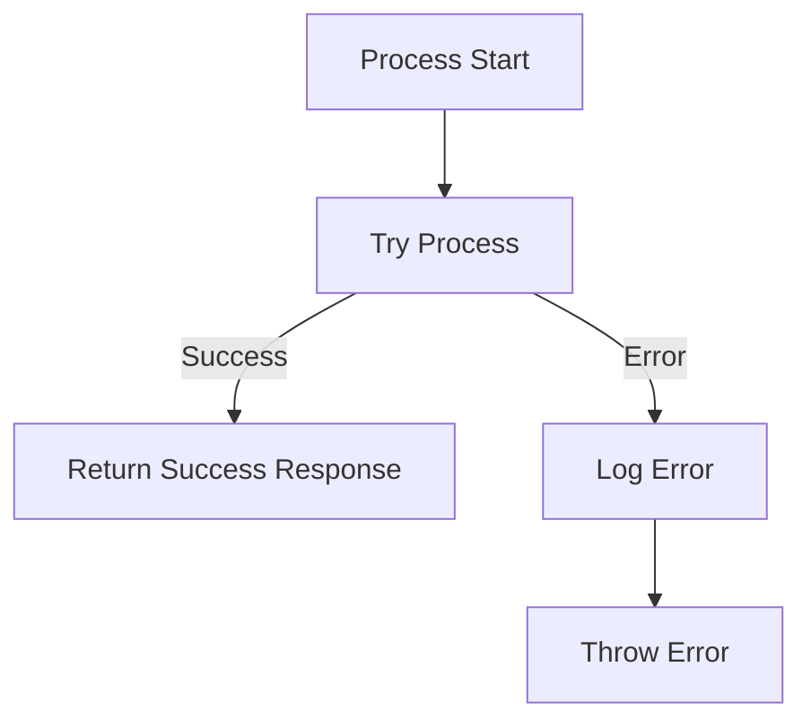

# Screener Processing Flow

## Service Interactions

## Data Flow

## Error Handling

This diagram illustrates the Screener processing flow, which handles incoming screener notifications by delegating to the Email Service to send appropriate notifications. 